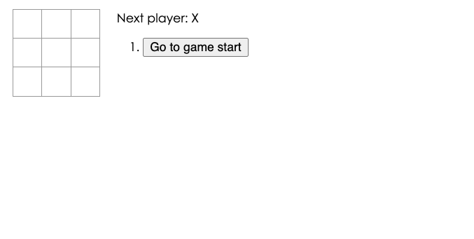
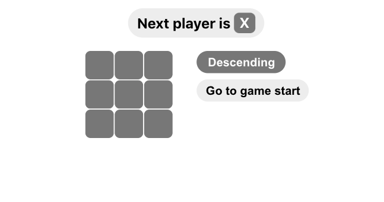
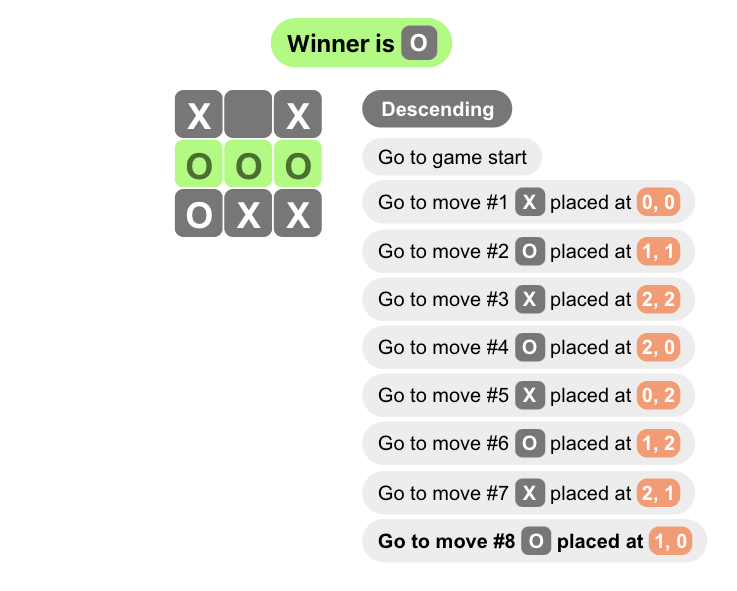

# Learning-React.js

A repository recording my journey of learning React.js

# Tic Tac Toe

It is still working in progress.

I made this project based on the [official React.js tutorial](https://reactjs.org/tutorial/tutorial.html).

You may try out Tic Tac Toe [here](https://locolin1204.github.io/Learning-React.js).

## Additional Features

1. Display the location for each move in the format (col, row) in the move history list.
2. Bold the currently selected item in the move list.
3. Rewrite Board to use two loops to make the squares instead of hardcoding them.
4. Add a toggle button that lets you sort the moves in either ascending or descending order.
5. When someone wins, highlight the three squares that caused the win.
6. When no one wins, display a message about the result being a draw.

## CSS Styling 

Below is the original UI of the tutorial.

And the following is the UI after I made some changes!

# my-app

This is just a react library for myself to do some testing.